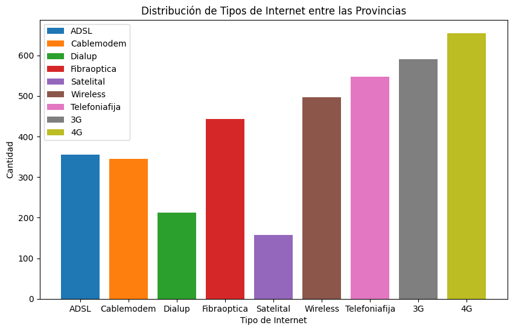
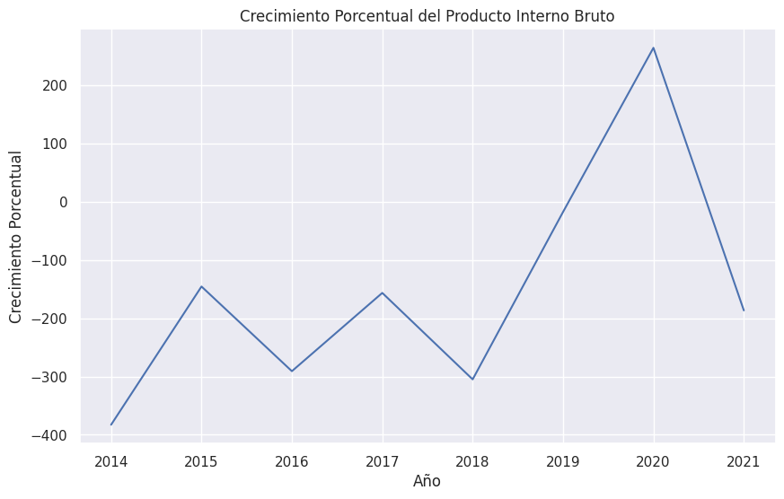
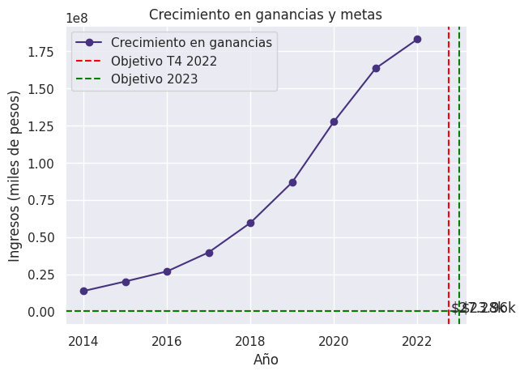

#### ESPAÑOL

---

# Proyecto Data Analyst Enacom

---

  

______________________________________________Descripcion del Proyecto______________________________________________

  
  
Este repositorio integra todo el Proyecto de Analisis de Negocio Sobre Enacom. Este esta enfocado en visualizar oportunidades de mercado y falencias sistematicas dentro del modelo de negocio propio de la empresa con , principalmente, datos relacionados a metricas tecnicas y Geograficas, Cumpliendo el rol de un Data Analyst.Es decir, Hacemos un Analisis Macroeconomico del Sector de Telecomunicaciones en Argentina.
  

---

## Encarpetado del Proyecto:

  

- DataSets: En esta carpeta se almacenan todos los datasets disponibles para el analisis.
  - Data Ingested: En esta carpeta se almacena la data sin procesar.
  - Data Proceses: En esta carpeta se almacena la data procesada.
- EDA_ET:: En esta carpeta se almacenan todos los archivos ingestados y procesados del proceso de ETL y EDA.
  - Archivos_EDA: Se guardan los resultados del EDA en Formato HTML.
  - ETL.ipynb: Archivo donde realice el ETL.
  - EDA.ipynb: Archivo donde realice el EDA.
- .gitignore: Este archivo ignora los archivos que no son relevantes para el proyecto pero que fueron necesarios para hacerlo.
- display_utils.py: Archivo con clase de python, que cree para visualizar mejor los dataframes de pandas en jupyter notebook.
- README.md: Archivo por donde se esta visualizando esto.
    

---

  

### KPIs Selecionados:

- Crecimiento de un 3% anual por provincia
- Aumento de un 3% en Fibra optica
- Crecimiento de un 5 % en accesos por cada 100 Hogares.
    

---

## Analisis:

- Gracias a estos graficos se obtuve los KPIs mas relevantes:
    

  

- Ademas de los graficos proporcionados por pandas profiling
- [Link de EDA deployment: ](https://eda-visualizar.onrender.com/#sample)

### Se pudo ver como provincias como Buenos Aires O o Caba tienen un mayor numero de Megabytes de bajada promedio. A su vez se vieron casos como tierra del fuego con muchos accesos por cada 100 hogares pero poca tasa de descarga. Reflejando poco uso de las distintas conexiones, se debe iniciar campañas de uso de la las tecnologias.

  

---

  

## Dashboard:

### Para revelar y presentar todas estas oportunidades de desarrollo se llevara a cabo un storytelling con un dashboard

- [Link del deplotment del dashboard: ](https://dashboard-emiliano-sosa-streamlit.onrender.com)

  

##### ********************************************************************************\_\_********************************************************************************Emiliano Sosa

---
